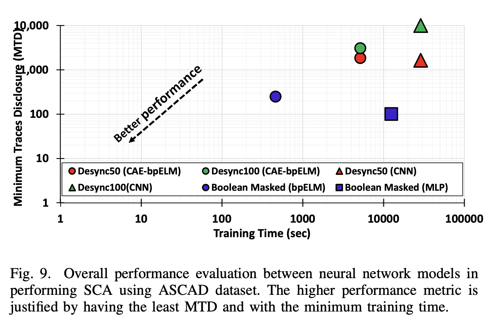

# Ensemble-bpELM & CAE-ebpELM
 Two fast training profiled DL-SCA models against synchronized or de-synchronized masked AES. (Don't forget hitting ⭐️STAR out there ↗️)

 Check this article for details: ***A Backpropagation Extreme Learning Machine Approach to Fast Training Neural Network-Based Side-Channel Attack*** (AsianHOST2021) [DOI: 10.1109/AsianHOST53231.2021.9699677](https://doi.org/10.1109/AsianHOST53231.2021.9699677).

 Authors: Xuyang Huang, Ming Ming Wong, Anh Tuan Do, Wang Ling Goh.

 *Institute of Microelectronics (IME), A\*STAR Singapore, Singapore.*

 *School of Electrical and Electronic Engineering, Nanyang Technological University, Singapore.*

# How to use
## Download datasets
ASCAD: [page link](https://github.com/ANSSI-FR/ASCAD/blob/master/ATMEGA_AES_v1/ATM_AES_v1_fixed_key/Readme.md)

## Attack
For Ensemble-bpELM (aligned traces): Please refer to *main_ebpelm.py*.

For CAE-ebpELM (misaligned traces): Please refer to *train_cae.py* for training CAE, *main_cae_ebpelm.py* for attack.

# Abstract
This work presented new Deep learning Side-channel Attack (DL-SCA) models that are based on Extreme Learning Machine (ELM). Unlike the conventional iterative backpropagation method, ELM is a fast learning algorithm that computes the trainable weights within a single iteration. Two models (Ensemble bpELM and CAE-ebpELM) are designed to perform SCA on AES with Boolean masking and desynchronization/jittering. The best models for both attack tasks can be trained 27× faster than MLP and 5× faster than CNN respectively. Verified and validated using ASCAD dataset, our models successfully recover all 16 subkeys using approximately 3K traces in the worst case scenario.

# Requirements
 Python >= 3.7, Tensorflow >= 2.1

# Performance
## Ensemble-bpELM
Best case: **256-nodes Ensemble bpELM with 10 epochs backpropagation**.
### Attacking Capability
The minimum traces to disclosure (MTD) for all 16 subkeys on ASCAD is **248 traces**.

### Training Efficiency
Our best-case Ensemble bpELM model only requires **462 sec** training time which is **27x faster** than MLP in our reproduction of [1].

## CAE-ebpELM
Best case: **1024-nodes CAE-ebpELM with 10 epochs backpropagation**.
### Attacking Capability
For desynchronized AES test case, our best model, 1024-nodes CAE-ebpELM with 10 epochs of backpropagation managed to recover all the 16 subkeys with MTD of **1,833 traces** for **Desync50** dataset and MTD of **3,057 traces** for **Desync100** dataset.

### Training Efficiency
1024-nodes CAE-ebpELM model requires a total of **86 min** where 30 min is for the auto-encoder training. Meanwhile, in CNN, the total training time is 480 min or approximately 30min/subkey (reproduction from [1]).

*[1] E. Prouff, R. Strullu, R. Benadjila, E. Cagli, and C. Canovas, “Study of deep learning techniques for side-channel analysis and introduction to ASCAD database,” IACR Cryptol. ePrint Arch., vol. 2018, pp. 53, 2018.*
## Experimental Setup
Ensemble bpELM and the Ensemble bpELM part of CAE- ebpELM are trained on AMD Ryzen 5 4600U @2.1GHz CPU and 16GB RAM without GPU.

The CAE part of CAE-ebpELM, MLP and CNN models are trained on Intel Xeon @2.3 GHz and 13 GB RAM with a NVIDIA Tesla P100, 12 GB RAM.
## Comparison

